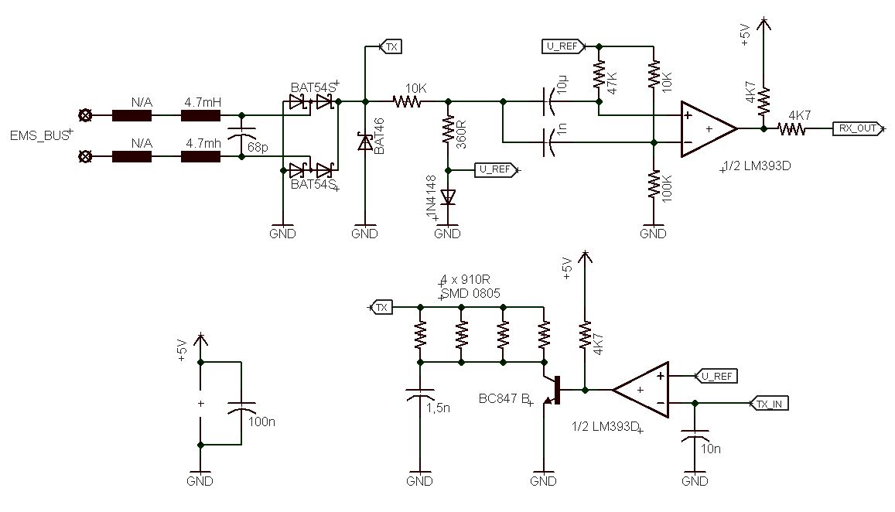
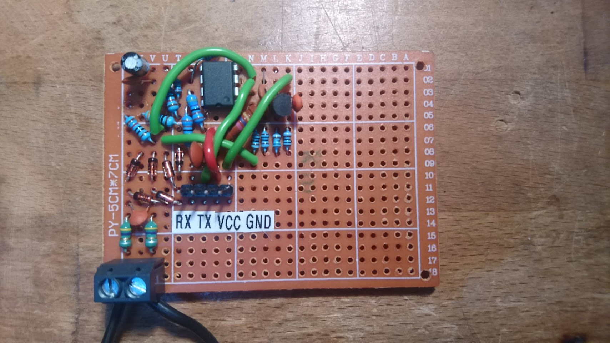
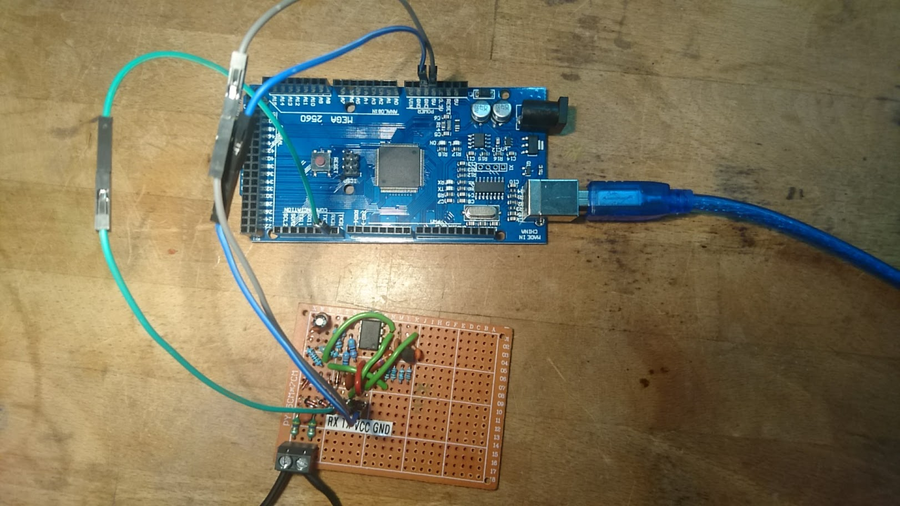

# pyems

Simple interface to access data on the EMS bus connected via an Arduino gateway.

## Prerequisites

In order to use this library, you need the following:

1. [EMS bus](https://domoticproject.com/ems-bus-buderus-nefit-boiler/),
2. Arduino Mega with [this sketch](arduino/src/main.cpp) uploaded,
3. Circuit board converting EMS to RX/TX signals,
4. PC to connect the Arduino to.

### Circuit board
You need to construct a board by the following schematic:



The result might look something like this:



Two EMS bus wires are connected to the input terminal. RX, TX, GND, VCC are then connected to the Arduino Mega (RX, TX to one of the Arduino's serial ports).

Detailed information is available at [this source](https://github.com/bbqkees/Nefit-Buderus-EMS-bus-Arduino-Domoticz/).

The complete interface looks as follows:



## Usage

### Example read
```python
from pyems import Ems, EmsError

try:
    # create and open the serial interface with default configuration
    ems = Ems()

    # read one frame from the bus
    data = ems.read()
    for value_meta, value in data:
        # process all values from the frame
        # value_meta = {name: '...', type: '...', ...}
        # value = numberic, boolean or string value
except EmsError as e:
    # handle error
```

### Example write
```python
from pyems import Ems, EmsError, GatewayResponse

try:
    # create and open the serial interface with default configuration
    ems = Ems()

    # get the command from loaded config by name
    cmd = ems.get_ems_command('UBAMonitorSlow')

    # send that command - block until it is processed by the gateway (Arduino)
    resp, extra = ems.write(req)

    if resp == GatewayResponse.SUCCESS:
        # successfully processed
    elif resp == GatewayResponse.FAILURE:
        # ...
    # ...
except EmsError as e:
    # handle error
```

### Custom configuration
Example configuration files [deafault.cfg](pyems/assets/default.cfg) and [decoding_table.json](pyems/assets/decoding_table.json) should be the base files of your custom configuration.

```python
from pyems import Ems, EmsError, GatewayResponse

try:
    # load custom config and decoding table
    ems = Ems(config_filename='config.cfg',
              decoding_table_filename='decoding_table.json')
except EmsError as e:
    # handle error
```